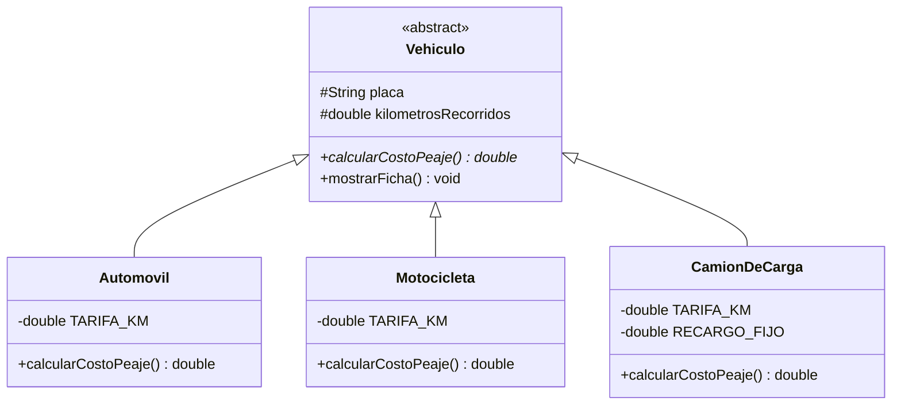

# Diagrama de Clases - Semana 8 (Diseño de Clases Abstractas - Módulo Transporte)

```mermaid
classDiagram
class Vehiculo {
<<abstract>>
#String placa
#double kilometrosRecorridos
+calcularCostoPeaje()* double
+mostrarFicha() void
}

class Automovil {
-double TARIFA_KM
+calcularCostoPeaje() double
}

class Motocicleta {
-double TARIFA_KM
+calcularCostoPeaje() double
}

class CamionDeCarga {
-double TARIFA_KM
-double RECARGO_FIJO
+calcularCostoPeaje() double
}

Vehiculo <|-- Automovil
Vehiculo <|-- Motocicleta
Vehiculo <|-- CamionDeCarga
```
